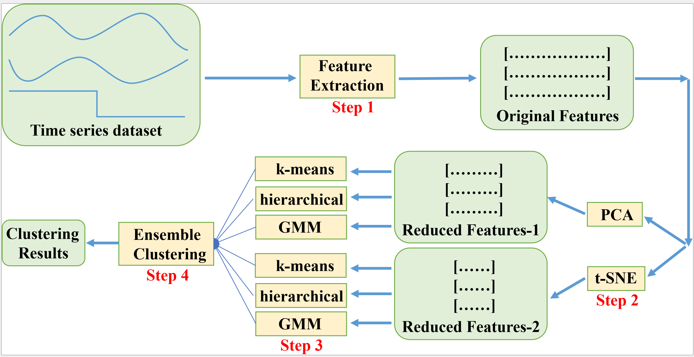
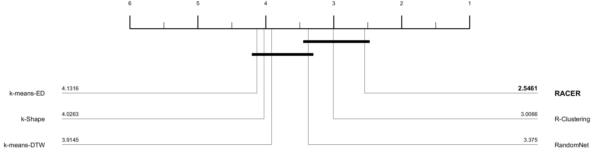
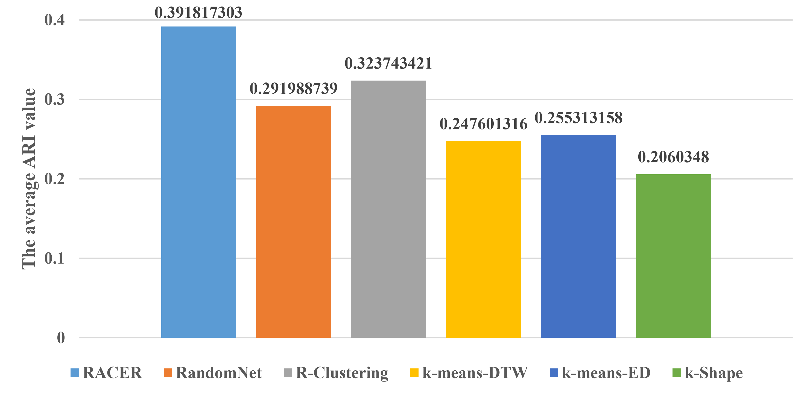

# RACER: Fast and Accurate Time Series Clustering with Random Convolutional Kernels and Ensemble Methods
This repository is the official implementation of [RACER: Fast and Accurate Time Series Clustering with Random Convolutional Kernels and Ensemble Methods], 
submitted to ECML-PKDD 2025  (Under Review)

## The overall execution process of applying the RACER algorithm to time series clustering.

 

## Main Results: Critical difference diagrams for all methods on UCR archive.

 

## Main Results: The average ARI value of each algorithm across the datasets used.

 

## The ARI values on the 117 UCR datasets can be found in the ARI_results.xlsx file.

## Usage

Our code is easy to run; simply execute RACER.py to generate results, which will be stored in output_time.csv.

## The UCR time series.

We directly read the UCR dataset through the interface of the aeon library.

UCR dataset(https://www.cs.ucr.edu/~eamonn/time_series_data_2018/)

## General Example
Four datasets 'coil100'， 'Wafer' ， 'mixed_sinx' and 'gaussin' are provided. Just run 'main.py'

**Requirements**: NumPy, scipy, matplotlib, aeon, sklearn, numba, pandas, pymetis, random, sktime

## Acknowledgments

The code for ClusterEnsembles is from https://github.com/827916600/ClusterEnsembles. A big thank you to the author!

We extend our gratitude to the authors of R-Clustering[1] and MiniROCKET[2] for providing their code!

Thanks to the authors of aeon[3] and sktime[4] for providing such excellent libraries!

[1] Jorge M B, Rubén C. Time series clustering with random convolutional kernels[J]. Data Mining and Knowledge Discovery, 2024, 38(4): 1862-1888.
[2] Dempster A, Schmidt D F, Webb G I. Minirocket: A very fast (almost) deterministic transform for time series classification[C]//Proceedings of the 27th ACM SIGKDD conference on knowledge discovery & data mining. 2021: 248-257.
[3] Middlehurst M, Ismail-Fawaz A, Guillaume A, et al. aeon: a Python toolkit for learning from time series[J]. Journal of Machine Learning Research, 2024, 25(289): 1-10.
[4] Löning M, Bagnall A, Ganesh S, et al. sktime: A unified interface for machine learning with time series[J]. arXiv preprint arXiv:1909.07872, 2019.

